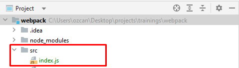
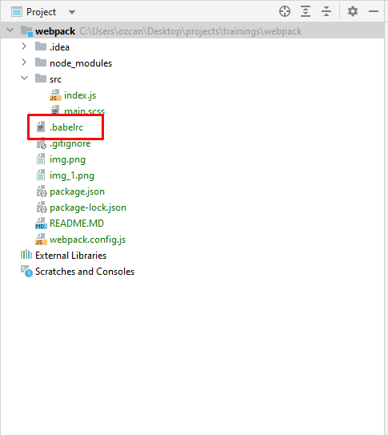

## WEBPACK KURULUMU
***
1.Proje dizini oluşturulur ve ilgili dizine gidilir. 
##### cd C/User/user/webpack-demo
2.package.json dosyası oluşturulur.
##### npm init -y
3.Proje github üzerinde saklanacaksa ilgili repo oluşturulur ve tanıtılır.
##### git remote add origin https://github.com/oozcann/webpack-demo.git
4.Webpack npm aracılığıyla kurulur.
##### npm install webpack webpack-cli --save-dev
5.src dizini altında index.js dosyası oluşturulur. index.js girdi dosyamızdır.
  
6.webpack.config.js dosyası oluşturulur. Bu dosya webpack ile ilgili konfigürasyonları yaptığımız dosyadır.
##### config dosyasındaki ayarlamaların açıklamalarını dosya içinde bulabilirsiniz.
## BABEL KURULUMU
***
1.npm aracılığıyla babel kurulur
##### npm install --save-dev babel-loader @babel/core
##### npm install @babel/preset-env --save-dev
Detaylı Babel kurulumu : 
##### https://babeljs.io/setup#installation
2.preset belirlemek için .babelrc dosyası ana dizinde oluşturulur.
  
3."presets": ["@babel/preset-env"] tanımlanır. (ES2015+ syntax'ı için). 
Diğer presetler için : 
##### https://babeljs.io/docs/presets
